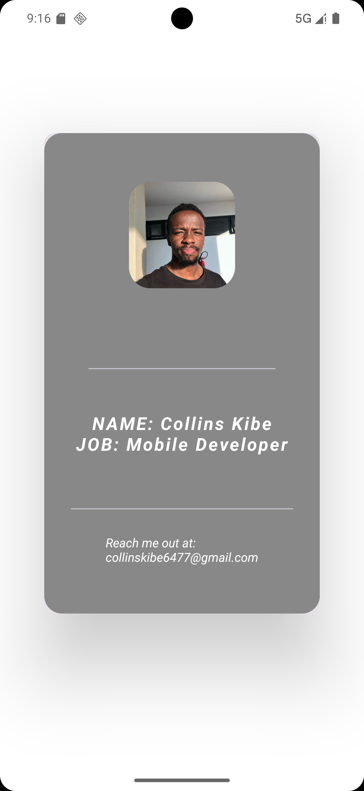

# 👤 Jetpack Compose Profile Card

A simple **Profile Card UI** built with **Jetpack Compose**, showcasing how to use core Compose layouts and components—`Box`, `Card`, `Column`, `Image`, `Divider`, `Text`, and style them with shapes, elevations, and spacing.

---

## ✨ Features

- 🖼️ **Circular Image** clipped with `RoundedCornerShape`
- 📇 **Card** with custom elevation via `CardDefaults.cardElevation`
- 📐 **Box & Column** for layout structure and centering
- ➖ **Divider** elements for visual separation
- 🎨 **Theming** with colors, shapes, and typography

---

## 📸 Screenshot




---

## 🚀 Getting Started

### Prerequisites

- Android Studio (Arctic Fox or later)
- Android SDK (API 31+)
- Kotlin & Jetpack Compose support enabled

### Steps

```bash
# 1. Clone the repo
git clone https://github.com/Kibeyy/YourRepoName.git
cd YourRepoName

# 2. Open in Android Studio
# 3. Let Gradle sync, then run the Preview or launch on a device/emulator
